<div align="center">
  

# Fablekin

### A narrative simulation engine for long-form adventures and animated visual novel rendering

[](#getting-started)
[](#getting-started)
[](engine/package.json)
[](engine/package.json)

Fablekin turns a player action into the next **complete scene**: planned against the story's history, written by specialized narrative agents, staged with characters and assets, rendered in PixiJS.
</div>

<p align="center">
  <a href="https://www.youtube.com/watch?v=ASqqOVWKXoE">
    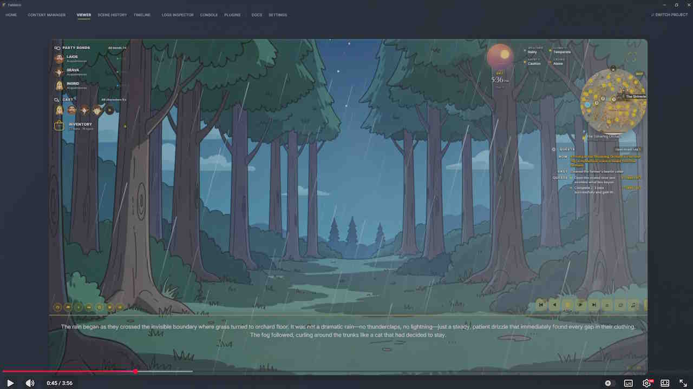
  </a><br>
  <em>Watch the Fablekin showcase on YouTube</em>
</p>

<p align="center">
  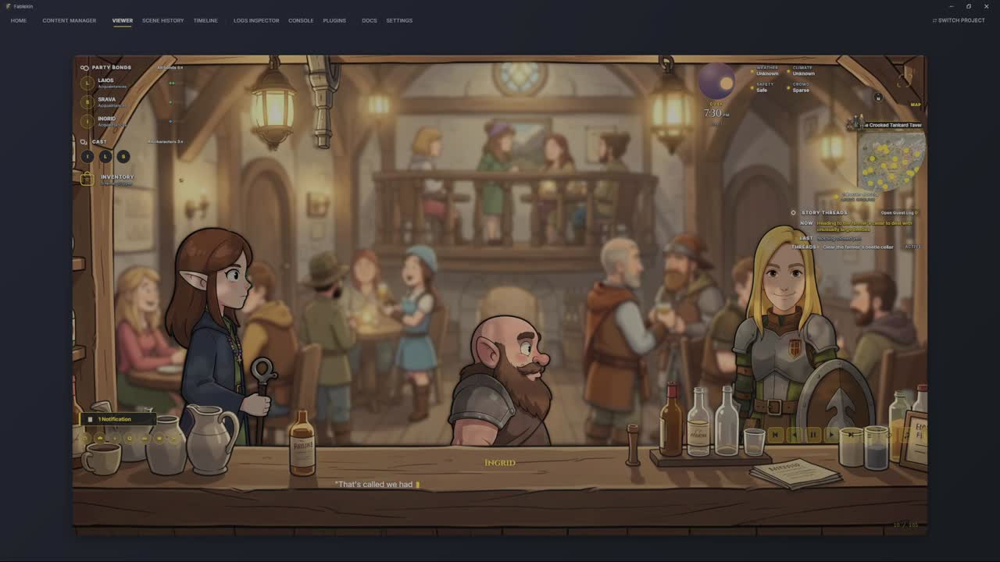
</p>

<p align="center">
  
</p>

## Why Fablekin exists

Most AI role-playing tools optimize for the fastest possible reply. That is a sensible goal for chat, but a weak foundation for a long-running world. A single model call is eventually asked to remember canon, portray an entire cast, move the plot, preserve secrets, write polished prose, select visuals, and avoid contradicting months of history. The result is familiar: flattening characters, forgotten intentions, arbitrary callbacks, and presentation that rarely changes the underlying experience.

Fablekin makes a different trade. A turn is treated as a production pipeline, and every stage receives a narrower job and an explicit contract. It may take minutes rather than seconds, but the output is designed to feel like the next scene of an adventure rather than the next message in a transcript.

| | Conventional AI role-play | Fablekin |
| --- | --- | --- |
| Unit of interaction | A chat reply | A planned, rendered scene |
| Narrative control | One prompt and one generation | Context foundation, Director strategy, Writer generation, and post-processing |
| Long-term memory | Growing transcript or flat similarity search | Full text, summaries, synopses, arc compression, dynamic elevation, and chronologically slotted recall |
| World continuity | Best-effort prose summaries | Persistent SQLite state, structured trackers, and turn snapshots |
| Cast | Static character cards sharing prompt space | Existing character material synthesized into persistent sheets and capsules, with goals, relationships, personalities, scene presence, and visual state |
| Presentation | Text with optional portraits | PixiJS staging, animated sprites, gaze, camera direction, backgrounds, music, shaders, VFX, SFX, TTS, and HUDs |
| Extensibility | Prompt presets or scripts around the chat loop | Lifecycle hooks, run profiles, UI views, GUI intercepts, client events, plugin storage, and project-scoped Story Scripts |

There are many things Fablekin attempts to solve:
- Characters have constant amnesia and have no will. I want a character to be busy looking for their lost sword, and if the user says "Let's go to the Inn to drink beer" I want the character to say "Woah there, first, we find my sword!"
- The user should not feel like a god. If the party is fighting a dragon, saying "I take out my flaming sword and defeat it with one strike" should elicit a reaction from the party "Are you drunk? You have no flaming sword! Run!". I want to feel like i'm participating, not directing.
- Everything should be designed around multi-character support. Characters should retain short and long term goals, temporarily leave the party to take care of errands and overall feel like they have their own agency.
- Detailed lore work should be optional, not wasted. I want to be able to drop in a large wiki article and let Fablekin organize it, while still supporting carefully keyworded lore books with trigger rules for creators who already use them.
- Memory should be managed while keeping chronological sense - no random RAG chunks and hoping the AI understands those pieces. Characters keep core memories attached, meaning even if the story grows too far and older chapters get compressed, characters will never forget their core memories.
- I want to drag & drop a few images and songs into a folder and have the system read the files and understand them by itself with zero configuration. Forest.jpg? Nice, we'll use it as background when we are in a forest. Spooky.mp3? Use it when we are in the haunted forest.
- I don't want it to feel like a prettified chat frontend. This is not a chat front end, this is a full fledged, real time rendered PIXIJS visual novel.
- I want the experience to feel like watching a sequel of our favourite fiction in high quality Visual Format.
- I want text to speech that is actually emotive - each dialogue goes through an emotion extractor so modern TTS systems can do the right tone for each situation, no monotone talking. I was able to get some genuinely impressive voice acting just by having the system understand the emotional state of each dialogue line.
- I want the system to not write bland stories. I want it to come up with genuinely interesting stories, and plan short and long term.
- I want the entire system to be moddable like skyrim, theres not a single thing that can't be modded, from the generation pipeline, to the interface and the visual novel rendering. 

<p align="center">
  
</p>

## What makes it different

### Memory is a system, not a larger prompt

Every canonical turn is stored as a `TurnContext`: an atomic capsule containing input, retrieved context, agent artifacts, prose, visual-novel output, runtime diagnostics, and persistence metadata. Old turns do not simply fall out of the context window.

Fablekin uses a memory level-of-detail model:

- Recent chapters remain available as full text.
- Middle history is represented by detailed summaries.
- Distant history becomes compact synopses and reusable story-arc tiles.
- Relevant old chapters can be promoted back to summary or full-text fidelity.
- Specific retrieved passages are inserted beside the chapter where they originally occurred, preserving temporal context instead of dumping disconnected RAG fragments at the end of a prompt.
- Unchanged material is content-hashed so it does not need to be indexed repeatedly.

Semantic retrieval is backed by local Ollama embeddings and LanceDB. Canonical turns, snapshots, structured facts, plugin state, and branches live in SQLite. The model receives both what is *relevant* and what the engine knows to be *true*.

### The story has a Director, not only a Writer

The optional Director acts like a GM checking the table before a scene begins. It reads the shared story foundation, maintains a persistent ledger, and gives the Writer concrete guidance about what to preserve, advance, avoid, or challenge.

That ledger can carry active threads, mysteries, logistics, interrupted goals, character agendas, world pressure, spoiler boundaries, and scene-level constraints. NPCs can initiate, disagree, leave, return, resume abandoned intentions, or pursue goals the player did not assign to them. Disable the Director when you want a faster, author-led experience; enable it when you want more autonomous story pressure.

Model routing is job-aware. Fablekin exposes Low, Medium, High, and Very High tiers so inexpensive helpers do not need to use the same model as the Writer, while compatible Director and Writer routes can reuse a shared prompt prefix for provider-side input caching.

### Prompt engineering is part of the architecture

Fablekin's consistency does not come from attaching "think step by step" to a large prompt. The Director and Writer use two substantial, hand-authored cognitive frameworks built from recurring failure modes in long-form AI role-play. They turn vague goals such as *make NPCs feel alive* or *remember the journey* into explicit audits the models must perform every scene.

| Framework | Responsibility | What it produces |
| --- | --- | --- |
| **Director CoT** | Decide what the story currently needs and what must remain true | Persistent Director notes plus a prioritized Writer's Brief |
| **Writer CoT** | Convert the player's attempt, the brief, canon, and current state into an executable scene | A checked, locked beat map followed by the final prose |

#### Director CoT: keeping the story from decaying

The [Director cognitive framework](engine/prompts/director/cot_steps.txt) is a story-level diagnostic pass. It does not merely suggest the next plot event. It asks whether:

- Interrupted character intentions should resume instead of being forgotten.
- The current scene is busy enough to block a new goal—or open enough for an NPC to initiate one.
- Characters should enter, leave, return from an off-screen task, or receive personal time away from the party.
- NPCs are acting toward one another rather than orbiting the player, and whether relationships feel mutual instead of player-operated.
- A character voice, temporary injury, running joke, plot device, or scene-ending pattern has become stale through repetition.
- A twist would actually repair stagnation or would only create arbitrary chaos.
- Player intent respects established abilities, relationships, consent, and character boundaries instead of receiving automatic wish-fulfillment.
- Weather, inventory, time, travel, location, danger, and setting technology still agree with the fiction.
- Old Director ideas should be applied now, carried forward with a reason, retired as stale, or rejected because the story has changed.

Its result is deliberately operational: scene review, mandatory orders, longer-term narrative threads, spoiler guardrails, and writing critiques. A structured [ledger schema](engine/prompts/director/ledger_sections.txt) carries party logistics, location, action queues, character agendas, mysteries, and other durable pressure into later turns. Separate output contracts govern the [analysis](engine/prompts/director/output_analysis.txt), [ledger update](engine/prompts/director/output_ledger.txt), and [plugin feedback](engine/prompts/director/output_plugin_feedback.txt).

This is how Fablekin can notice that a hungry character never finished lunch, a companion has been silent despite standing in the room, a journey has crossed three chapters without advancing time, or every recent scene has ended with the same question—without the player having to complain about it first.

#### Writer CoT: preventing good direction from disappearing into prose

The [Writer cognitive framework](engine/prompts/writer_chain_of_thought.txt) is a separate pre-writing discipline. It begins by treating user input as an **attempt**, not a guaranteed outcome. It decomposes every Director instruction into priorities, reconstructs the relevant character headspaces and knowledge gaps, and then plans the chapter before generating prose.

Its checks include visible character continuity; relationship and world familiarity; plausible time and travel; setting-appropriate technology; player agency; information asymmetry; scene pacing; sensory detail; gameplay handoff boundaries; and explicit feedback-to-action mapping. It then stress-tests and locks a short beat map, verifies every player-spoken line and attempted action appears on-page, checks mandatory orders again, audits common prose clichés, and enforces a dialogue-forward visual-novel scene rather than a wall of narration.

The separation matters: the Director decides **what the living story needs**, while the Writer decides **how this particular scene can deliver it without breaking character, canon, player agency, or presentation**. The final prose is written only after both layers have done their work.

Both frameworks are extensible at runtime. Plugins can add Director prompt sections or insert new Writer CoT steps at defined positions, allowing gameplay and simulation systems to participate in planning without replacing the core reasoning contract.

You can inspect examples of the frameworks operating on a real turn in the bundled [Director output](engine/views/home/media/director-example.txt) and [Writer CoT output](engine/views/home/media/writer-cot-example.txt).

### The visual novel is part of the engine

Generated prose is transformed into an executable scene sequence rather than placed into a text box.

- Dialogue is parsed into speakers, narration, and scene beats.
- Characters enter, leave, change slots, move, and retain stable visual state.
- Emotion, outfit variants, talking/blinking layers, and optional rotational sprites are resolved from available assets.
- Automatic gaze turns the speaker toward the viewer and other characters toward the speaker.
- Backgrounds and OST are selected from the narrative context.
- Cinematic commands can control framing, camera movement, emotes, titles, animation, VFX, SFX, and transitions.
- Optional shaders provide weather, particles, overlays, depth-aware bloom, ambient light spread, and parallax.
- Every turn receives a final-frame thumbnail for scene history and timeline navigation.

<p align="center">
  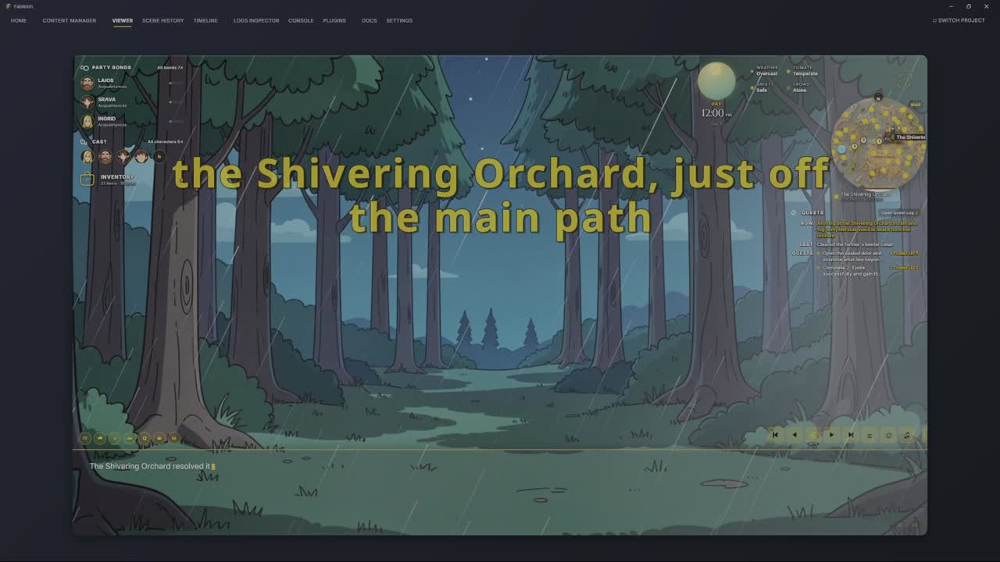
</p>

An optional 2.5D stage calibrator can place characters *inside* a background's perspective instead of treating every scene as a flat row of portraits.

<p align="center">
  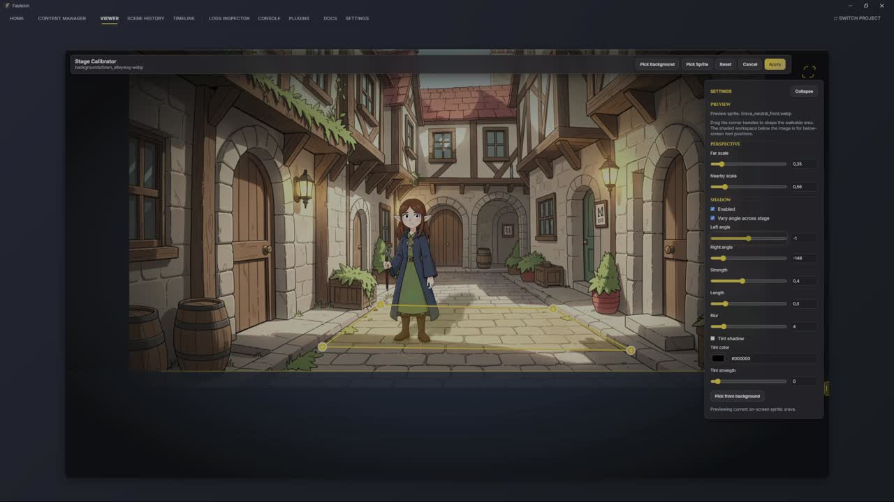
</p>

### Emotion-aware local voice acting

TTS doesn't have to mean that every character reads every line in the same neutral voice. 
Fablekin's emotion classifier looks at dialogue in the context of the full scene and attaches mood metadata such as `angry`, `happy`, `sad`, `annoyed`, `fearful`, or `caring` before the line is sent for synthesis. With good-quality reference recordings, the result can be remarkably expressive—closer to actual voice acting than the monotone delivery usually associated with generated TTS.

Right now, it's only supported running [IndexTTS2](https://github.com/index-tts/index-tts) or [Spark-TTS](https://github.com/SparkAudio/Spark-TTS) locally. They are independent projects and must be downloaded and installed from their own official sources.

What Fablekin does provide is a small Python API wrapper for each engine:

- [IndexTTS2 wrapper](tools/TTS_Setup_Guide/IndexTTS2/tts_api.py)
- [Spark-TTS wrapper](tools/TTS_Setup_Guide/Spark-TTS/tts_api.py)
- [Local TTS setup and API guide](tools/TTS_Setup_Guide/README.md)

Drop the matching wrapper into the TTS installation and it exposes the batch API Fablekin expects, including character-aware voice lookup, project-local voice folders, progress callbacks, job cancellation, and generated-audio delivery. Fablekin caches lines by CRC, archives completed audio with the story, and can regenerate only the lines affected when a scene is edited.

This means you can have mood-specific reference clips. For example, a project can provide `Character.wav` as the normal voice and `Character_angry.wav` or `Character_happy.wav` as emotional references. Fablekin discovers the available moods from the filenames, constrains classification to clips that actually exist, and sends the selected mood with each dialogue line. If a matching emotional clip is unavailable, the wrapper falls back to the character's base voice instead of failing the scene.

> [!CAUTION]
> **Use voice cloning responsibly.** Only use voice samples you created, licensed, or have explicit permission to use. Do not clone or impersonate a real person's voice without their informed consent. Fablekin does not include, host, or share voice samples or generated TTS content; the user is responsible for the voices, models, and audio they run locally, and for respecting the applicable rights and laws.

### Assets are drop-in by default

Fablekin resolves assets case-insensitively and uses descriptive filenames as lightweight metadata, choosing the right asset at the right time without any user configuration. Just drop "Forest.jpg" into the backgrounds folder, and if the scene (or part of the scene) happens in a forest, the system will swap to that background automatically.

For character sprites, project can begin with one image per character and grow into emotion, outfit, rotation, blink, and talking variants later.

| Asset | Simple example | Supported formats |
| --- | --- | --- |
| Sprite | `Turiel.webp`, `Turiel_happy.webp` | `.webp`, `.png` |
| Background | `moonlit_forest.webp` | `.png`, `.jpg`, `.jpeg`, `.gif`, `.bmp`, `.webp`, `.mp4`, `.webm` |
| Music | `quiet_tavern.ogg` | `.mp3`, `.ogg`, `.wav` |

Advanced projects can add `metadata.json` for precise matching, stage calibration, aliases, or richer asset behavior. The basic workflow remains drag, drop, and name clearly.

<table align="center">
  <tr>
    <td align="center"></td>
    <td align="center"></td>
    <td align="center"></td>
  </tr>
  <tr>
    <td align="center">Sprites</td>
    <td align="center">Backgrounds</td>
    <td align="center">OST</td>
  </tr>
</table>

### Generate a production-sized sprite set in under an hour

A single character portrait is easy. A character who can turn, emote, change clothes, speak, and blink across an entire visual novel is a combinatorial art problem. Even a modest matrix of outfits, emotions, and rotations quickly becomes hundreds of individual files:

```text
[outfit]/[character]_[emotion]_[rotation].webp
[outfit]/[character]_[emotion]_[rotation]_blink.webp
[outfit]/[character]_[emotion]_[rotation]_talk.webp
[outfit]/[character]_[emotion]_[rotation]_talk_blink.webp
```

Fablekin includes a dedicated AI-assisted **Sprite Generator** for producing that matrix as a guided batch. Give it a character reference, choose the expressions and viewing angles, and it manages the generation and processing workflow: identity/outfit preservation prompts, task progress, background removal, alignment, optional upscaling and frame fitting, symmetric-angle mirroring, and final WebP export. It can route generation through a hosted image provider or a local ComfyUI workflow.

For every completed emotion and rotation, the tool exports the four runtime states Fablekin's `SpriteAnimator` understands: base pose, blink, talk, and talk+blink. The resulting files can be dropped directly into the project's asset folders and resolved automatically during scene construction.

What could require hundreds of hours of manual drawing, masking, naming, and alignment can become a repeatable workflow completed in under an hour for a typical character set. More importantly, visual fidelity no longer has to be reserved for two or three favorite expressions—the whole cast can have enough coverage to move and react naturally.

<p align="center">
  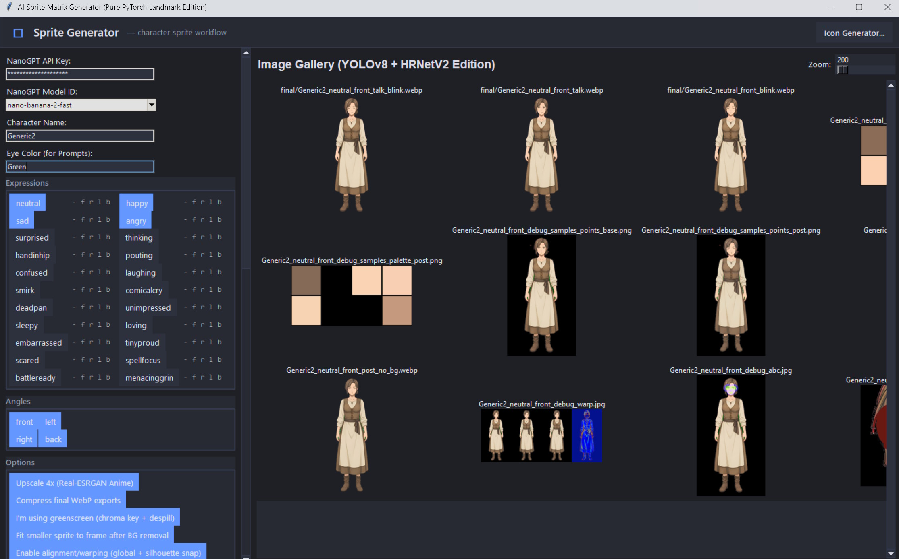
</p>

### Everything is a pipeline surface

Fablekin is plugin-first. Plugins can participate in narrative generation, inject prompt components into specific agent slots, persist data, register settings and file modes, add tabs and HUD panels, intercept the UI, emit visual commands, or hand a scene to an entirely different gameplay mode.

Bundled systems include:

- **Narrative:** Grand Story Planner, Narrative Architect, Story Arc Tracker, output control, and post-writer consistency checking.
- **Characters:** character classification and sheets, personality evolution, relationship tracking, and persistent character recall.
- **World:** world state, inventory, objectives, location-aware maps, route planning, and story-aware travel.
- **Presentation:** cinematography, PixiJS VFX, SFX, TTS, CG intermissions, sprite shading, depth-aware backgrounds, and a shared VN HUD.
- **Interludes:** camp scenes, tabletop-style adventure books, arc cinematics, and other alternate scene runtimes.

Plugins declare dependencies and expose cost, latency, narrative-impact, and immersion metadata in the onboarding UI. They can run sequentially, in parallel, or as fire-and-forget work. Mainline turns and virtual Interludes use explicit run profiles so plugins cannot accidentally write into canonical history.

### Every scene leaves a trace

A pipeline this large would be impossible to tune if it behaved like a black box. Fablekin treats observability as part of the engine: each generated scene produces a structured turn record alongside its full console log, so the path from player input to final presentation can be inspected after the fact.

The Logs Inspector turns that record into several complementary views:

- A **waterfall timeline** shows every LLM operation in its actual execution window, grouped by blocking and asynchronous hook phases. It makes concurrency visible, identifies the slowest stage, and distinguishes when the scene became playable from when all background work finished.
- **Request, response, error, and diagnostic payloads** are grouped by named task, making it possible to inspect what a specific Director pass, classifier, extractor, selector, or plugin received and returned.
- **Token and cost accounting** is broken down by provider, model, and task, including uncached input, cache reads and writes, generated output, reasoning usage, cache-hit percentage, and estimated cache savings. Provider-reported usage is used when available; otherwise Fablekin derives a local estimate from the configured pricing data.
- The persisted **TurnContext** connects those traces to the resulting prose, prompt components, retrieved memories, world and character state, VN scene data, and plugin artifacts. The Memory Console can inspect that state, retrieval results, facts, hooks, and plugin data for a selected turn.

This means a continuity failure, expensive prompt, slow plugin, bad asset choice, or unexpected background task can be traced to a concrete stage and payload instead of guessed from the final scene. The same instrumentation is useful for development, model routing, prompt tuning, cache verification, and ordinary project debugging.

<p align="center">
  
</p>

<p align="center">
  
</p>

## How a turn works

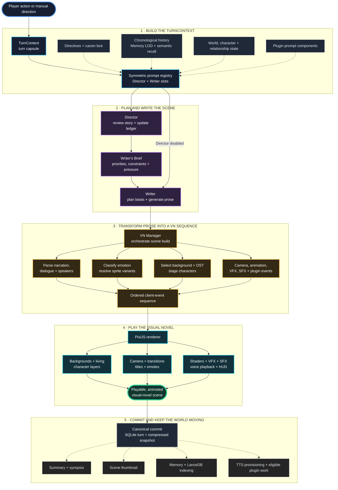
```mermaid
flowchart TB
    INPUT(["Player action or manual direction"]):::input

    subgraph CONTEXT["1 · BUILD THE TURNCONTEXT"]
        direction LR
        TURN["TurnContext<br/>turn capsule"]:::core --> PROMPT["Symmetric prompt registry<br/>Director + Writer slots"]:::core
        CANON["Directives + canon lore"]:::source -.-> PROMPT
        MEMORY["Chronological history<br/>Memory LOD + semantic recall"]:::source -.-> PROMPT
        STATE["World, character + relationship state"]:::source -.-> PROMPT
        EXTENSIONS["Plugin prompt components"]:::source -.-> PROMPT
    end

    subgraph NARRATIVE["2 · PLAN AND WRITE THE SCENE"]
        direction LR
        DIRECTOR["Director<br/>review story + update ledger"]:::agent --> BRIEF["Writer's Brief<br/>priorities, constraints + pressure"]:::agent
        BRIEF --> WRITER["Writer<br/>plan beats + generate prose"]:::agent
    end

    subgraph TRANSFORM["3 · TRANSFORM PROSE INTO A VN SEQUENCE"]
        direction LR
        MANAGER["VN Manager<br/>orchestrate scene build"]:::vn
        DIALOGUE["Parse narration,<br/>dialogue + speakers"]:::vn
        EMOTION["Classify emotion<br/>resolve sprite variants"]:::vn
        ASSETS["Select background + OST<br/>stage characters"]:::vn
        CINEMA["Camera, animation,<br/>VFX, SFX + plugin events"]:::vn
        EVENTS["Ordered client-event sequence"]:::vn

        MANAGER --> DIALOGUE --> EVENTS
        MANAGER --> EMOTION --> EVENTS
        MANAGER --> ASSETS --> EVENTS
        MANAGER --> CINEMA --> EVENTS
    end

    subgraph VIEWER["4 · PLAY THE VISUAL NOVEL"]
        direction LR
        PIXI["PixiJS renderer"]:::viewer
        LAYERS["Backgrounds + living<br/>character layers"]:::viewer
        DIRECTION["Camera + transitions<br/>titles + emotes"]:::viewer
        IMMERSION["Shaders + VFX + SFX<br/>voice playback + HUD"]:::viewer
        FINAL(["Playable, animated<br/>visual-novel scene"]):::final

        PIXI --> LAYERS --> FINAL
        PIXI --> DIRECTION --> FINAL
        PIXI --> IMMERSION --> FINAL
    end

    subgraph PERSISTENCE["5 · COMMIT AND KEEP THE WORLD MOVING"]
        direction LR
        COMMIT["Canonical commit<br/>SQLite turn + compressed snapshot"]:::persist
        SUMMARY["Summary + synopsis"]:::async
        THUMBNAIL["Scene thumbnail"]:::async
        INDEX["Memory + LanceDB indexing"]:::async
        BACKGROUND["TTS provisioning + eligible plugin work"]:::async

        COMMIT -.-> SUMMARY
        COMMIT -.-> THUMBNAIL
        COMMIT -.-> INDEX
        COMMIT -.-> BACKGROUND
    end

    INPUT --> TURN
    PROMPT --> DIRECTOR
    PROMPT -->|Director disabled| WRITER
    WRITER --> MANAGER
    EVENTS --> PIXI
    FINAL --> COMMIT

    classDef input fill:#172033,stroke:#60a5fa,color:#ffffff,stroke-width:3px;
    classDef core fill:#172033,stroke:#38bdf8,color:#ffffff,stroke-width:2px;
    classDef source fill:#202938,stroke:#64748b,color:#e2e8f0,stroke-dasharray:5 4;
    classDef agent fill:#2f2140,stroke:#c084fc,color:#ffffff,stroke-width:2px;
    classDef vn fill:#332915,stroke:#f5c451,color:#ffffff,stroke-width:2px;
    classDef viewer fill:#12313b,stroke:#22d3ee,color:#ffffff,stroke-width:2px;
    classDef final fill:#12372f,stroke:#34d399,color:#ffffff,stroke-width:4px;
    classDef persist fill:#1f2937,stroke:#a3a3a3,color:#ffffff,stroke-width:2px;
    classDef async fill:#252525,stroke:#94a3b8,color:#e2e8f0,stroke-dasharray:5 4;
```

*Solid arrows show the path to a playable scene. Dotted arrows show supporting context and work that can continue after delivery.*

1. The runner resolves the project, active chronicle, scene mode, and run profile.
2. A `TurnContext` is created and filled with directives, lore, recent history, retrieved memories, and structured simulation state.
3. The Director optionally updates its ledger and produces a Writer brief.
4. The Writer generates the prose for the next scene.
5. The VN manager parses dialogue and runs the blocking analysis needed to display the scene: assets, emotions, staging, scene-phase handoffs, and client events.
6. The scene is rendered and broadcast to the Viewer.
7. The canonical turn is committed while summaries, thumbnails, memory indexing, TTS, and eligible plugin work continue in the background.

Virtual Interludes reuse the same primitives but are stored outside the canonical timeline unless explicitly integrated.

<p align="center">
  
</p>

## A workspace

The Viewer is one part of Fablekin. The application also includes:

- A **Content Manager** for directives, lore, player identity, custom file modes, and assets.
- **Scene History** and a branching **Timeline** for inspecting or rewinding the adventure.
- A **Logs Inspector** with agent traces, timing, token, cost, payload, and waterfall-style diagnostics.
- A **Memory Console** for inspecting turn capsules, hooks, retrieval, and plugin state.
- A searchable, built-in **Docs** workspace generated alongside the codebase.
- Global settings for providers, model routing, memory budgets, visual behavior, audio, and themes.

<p align="center">
  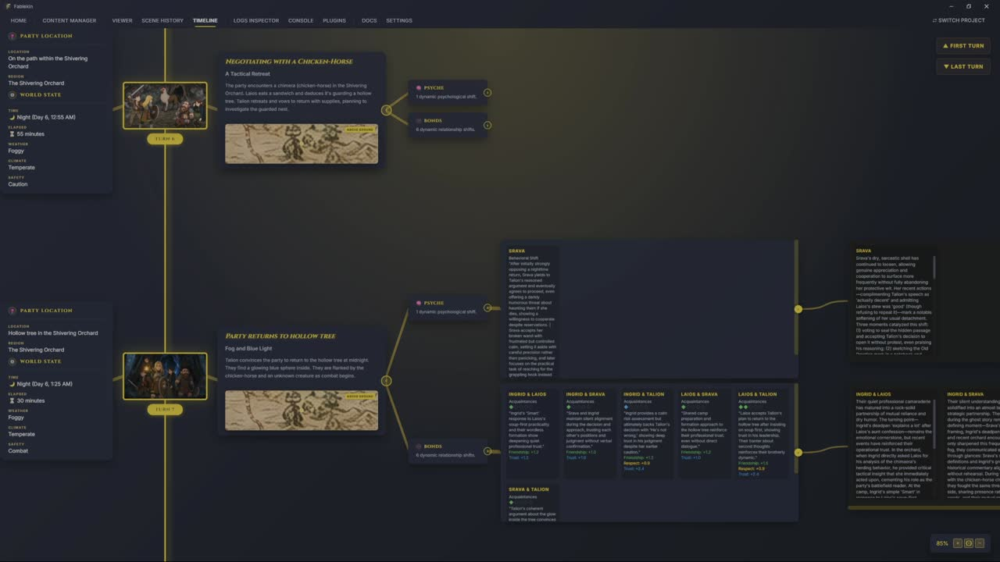
</p>

<p align="center">
  
</p>

## Getting started

### Requirements

- The guided installer currently supports Windows only, but this being electron, Linux / Mac should be supported.

If using the guided installer, the following requirements should not have to be manually installed:
- Node.js 18 or newer and npm
- Ollama with an embedding model; the default is `nomic-embed-text`
- An API key for at least one configured generation provider

The installer checks these dependencies, explains downloads before they happen, can install Node.js and Ollama through `winget`, installs the Electron packages, prepares the branded runtime, and runs a final health check.

### Install and launch

1. Clone or download the repository.
2. Run `install.bat` from the repository root.
3. Run `run.bat`.
4. Follow the **Home** first-run guide to save a provider key and verify Ollama.
5. Open the bundled example project, read its player bio and world-building file, then generate one scene in the Viewer.

API credentials are encrypted locally through Electron's OS-backed secure storage. Fablekin only sends model requests to providers you configure; project files, databases, embeddings, and generated assets remain in the local workspace unless a configured provider or plugin explicitly processes them.

### Build your first project

A project is a portable folder under `workspace/projects/`:

```text
workspace/projects/MyAdventure/
|-- 1_Directives/       # writing rules and non-negotiable instructions
|-- 2_Lore_Book/        # canon, world-building, and character material
|-- 3_Chronicles/       # SQLite adventure databases
|-- assets/             # sprites, backgrounds, music, SFX, and other media
|-- plugins/            # project- and chronicle-scoped plugin data
|-- vectors/            # local LanceDB embeddings
`-- MyAdventure.config  # portable file-mode and project configuration
```

The shortest path is:

1. Create a project in the Project Selector.
2. Define the player character.
3. Add directives and enough lore to establish the world.
4. Drop clearly named assets into the project.
5. Generate a scene before tuning advanced memory, routing, or plugins.

Projects use relative persisted paths and can be moved, backed up, or shared as folders. Chronicles can branch from an earlier turn into a separate SQLite timeline without destroying the original story.

<p align="center">
  
</p>

## Choosing a power level

Fablekin is deliberately scalable. You decide how much pipeline you want to pay for in time and tokens.

- **Text Adventure:** Writer-only generation for the fastest and least expensive experience.
- **Native Fablekin:** Director, continuity helpers, asset selection, character emotions, animated sprites, backgrounds, and music.
- **Plugin Heavy:** character simulation, world systems, voice, cinematography, shaders, SFX, CG scenes, gameplay handoffs, and custom interfaces.

There is no universal scene time or cost. Provider load, model choice, reasoning depth, cache support, prompt size, asset availability, retries, and enabled plugins all matter. Fablekin exposes these tradeoffs rather than pretending the full pipeline is free.

<p align="center">
  
</p>

## Development

The main extension reference is in [`engine/modules/plugin_manager/plugin_api_reference.md`](engine/modules/plugin_manager/plugin_api_reference.md). The generated documentation index is available at [`engine/views/docs/documents/README.md`](engine/views/docs/documents/README.md).

<p align="center">
  
</p>

## Current expectations

- Fablekin is designed around scenes, so generation can take many minutes with reasoning and plugins enabled.

- There will be plenty of bugs to be fixed.

- AI coding agents were used as implementation tools, while the architecture, system design, prompting frameworks, and technical direction were developed and iterated manually. As with any project of this size, occasional implementation artifacts may remain.

- The guided setup and branded launcher currently target Windows.
- Generation quality and operating cost depend on the models and providers you choose.
- Visual fidelity depends on the assets you supply and have the right to use.
- Plugins can add LLM calls, latency, storage, and external integrations; enable them deliberately and review their settings.

- Tested on an RTX 5080 using 6K assets, however your mileage may vary. It might be best to use lower fidelity backgrounds/sprites to avoid performance issues.


<p align="center">
  
</p>

## Future of the project
Fablekin is a one-person project developed to learn more about AI, memory management and prompt engineering, and then to be for personal use.
I don’t intend nor do I have the time to personally maintain an integration for every LLM provider, TTS service, image generator, or feature someone might want. I’ve included the services and systems I personally use or considered broadly useful.

The goal of the plugin system is that this shouldn’t be a bottleneck. If you’re a developer and there’s something you want Fablekin to do, the answer should ideally be: give it a try. 
Plugins can participate throughout the generation pipeline, add interfaces and HUDs, persist their own state, introduce new scene modes, and integrate external services without requiring changes to the core engine.
Plugins can almost literally change anything, and I have included somoe wiki docs, and some example plugins. Specially with an AI coding agent, getting started on creating/changing a plugin should be relatively simple.

<p align="center">
  
</p>

## Included plugins

Fablekin ships with opt-in plugins for narrative simulation, visual-novel presentation, and gameplay experiments. They are deliberately modular: enable the pieces that fit a project rather than treating the entire list as required. The most immediately visible and broadly useful modules come first; the final group is a set of developer references.

### Cinematic presentation and character life

- **VN Cinematographer** (`vn_cinematographer`) — turns narrative beats into camera, animation, title, VFX, and SFX direction.
- **CG Generator** (`cg_generator`) — generates context-aware visual-novel CG overlays through pluggable image providers.

<p align="center">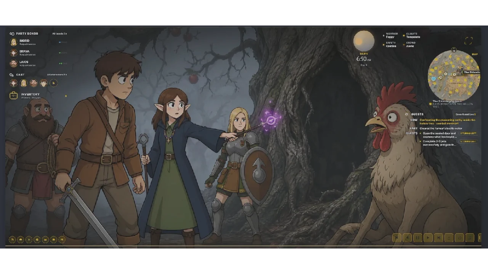</p>

- **VN PixiJS VFX** (`vn_pixijs_vfx`) — triggerable cloud and volumetric-fog shaders for the VN stage.

<p align="center">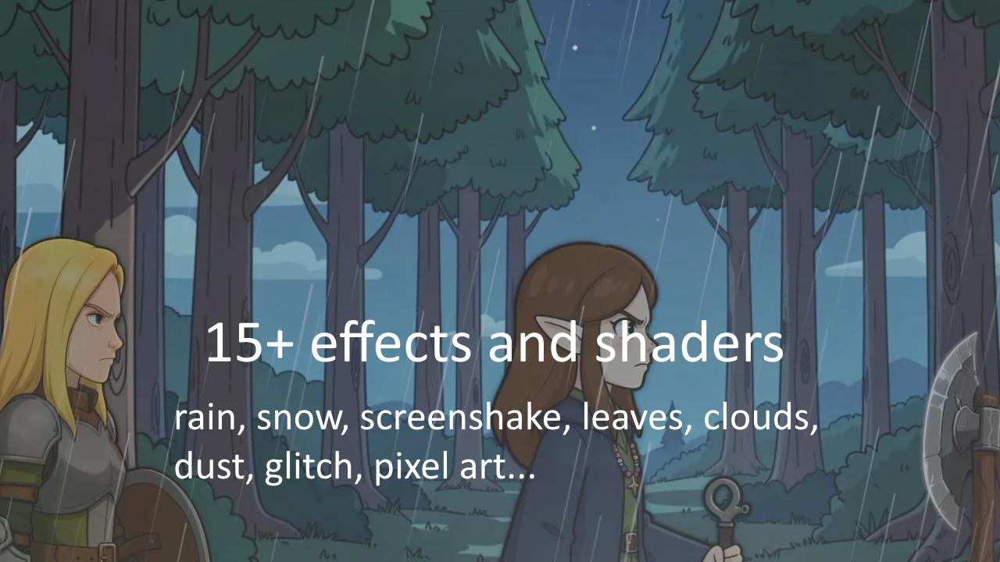</p>

- **VN Alive Backgrounds** (`vn_alive_bg`) — adds ambient lighting, bloom, light spread, and cursor parallax to backgrounds.
- **Sprite Shading** (`sprite_shading`) — shades sprites against the active background for a more grounded scene.

<p align="center"></p>

- **VN SFX** (`vn_sfx`) — manages one-shot and looping scene sound effects.
- **TTS Core** (`tts_core`) — centralizes text-to-speech, voice selection, progress, and selective regeneration.
- **Arc Cinematics** (`arc_cinematics`) — supplies cinematic openings when a new narrative arc begins.

<p align="center">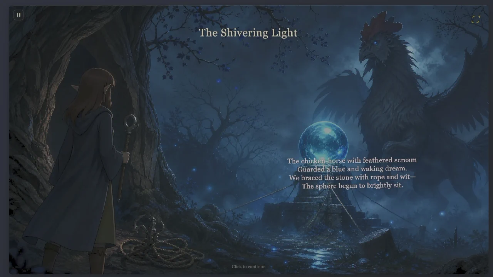</p>

- **VN HUD** (`vn_hud`) — a managed on-canvas home for compact plugin panels and shared modals.

### Persistent cast and social simulation

- **Character Sheets** (`character_sheets`) — turns source material into persistent high-detail sheets and efficient supporting-cast capsules.

<p align="center">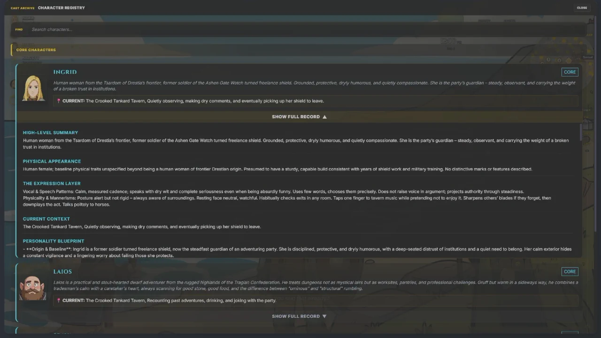</p>

- **Relationship Tracker** (`relationship_tracker`) — tracks symmetrical friendship, romance, trust, fear, and respect between characters.

<p align="center">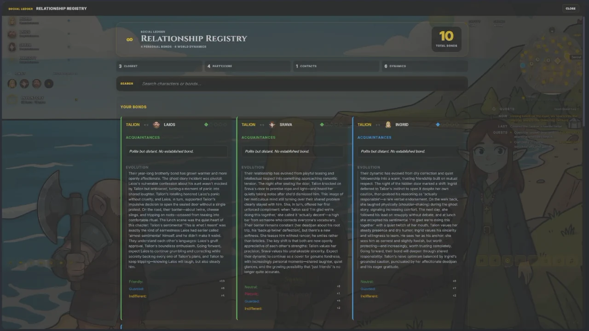</p>

- **Personality Tracker** (`personality_tracker`) — evolves OCEAN traits and esteem from narrative behavior.
- **Character Echoes** (`character_echoes`) — periodically interviews core characters to keep their inner lives fresh.
- **Character Classifier** (`character_classifier`) — identifies character importance and attributes so costly tracking can focus on the cast that matters.

### World, memory, and story direction

- **Lore Book** (`lore_book`) — classic keyword- and regex-triggered lore injection with priorities, recursion, and token budgets.

<p align="center">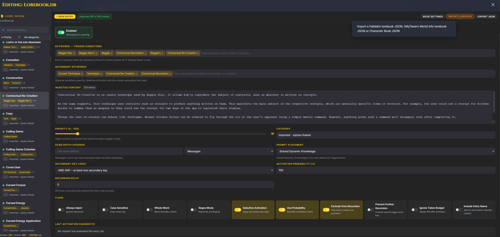</p>

- **Grand Story Planner** (`grand_story_planner`) — maintains hidden long-range arcs and strategic pressure for the Director.
- **Memory Recall** (`memory_recall`) — recalls concise character, relationship, world, and location memories at prompt time.
- **World State Tracker** (`world_state_tracker`) — maintains global facts such as time, weather, and inventory.

<p align="center">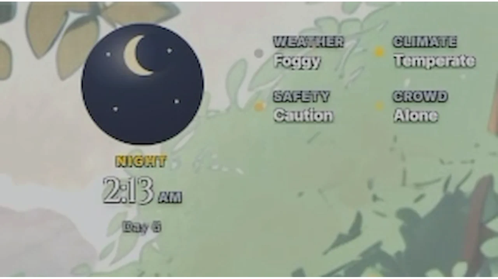</p>

- **World Location Tracker** (`world_location_tracker`) — manages locations, routes, and location-specific prompt context.

<p align="center">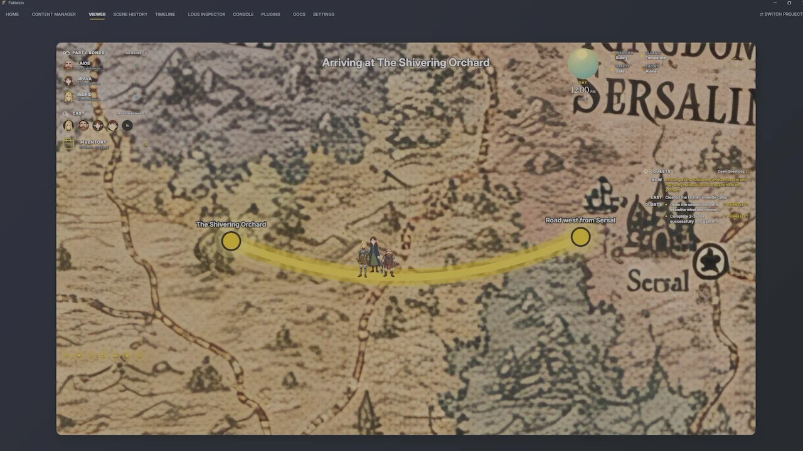</p>

- **Story Arc Tracker** (`story_arc_tracker`) — detects arc boundaries and can request an Arc Cinematics introduction.
- **Story Objective Tracker** (`quest_tracker`) — tracks player-facing objectives in a compact Story Threads HUD.

<p align="center">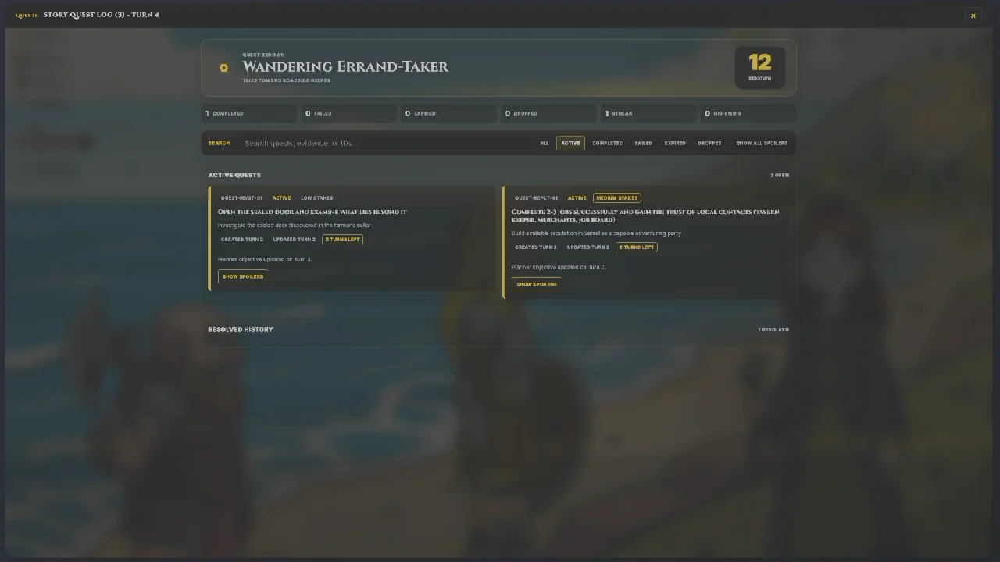</p>

- **Narrative Architect** (`narrative_architect`) — brings structural guidance from acclaimed episodes into planning.
- **Post Writer Consistency Checker** (`post_writer_consistency_checker`) — finds and corrects hallucinations, contradictions, and continuity errors after writing.
- **Output Size Controller** (`output_size_controller`) — sets story length targets with play-time and dialogue estimates.

<p align="center">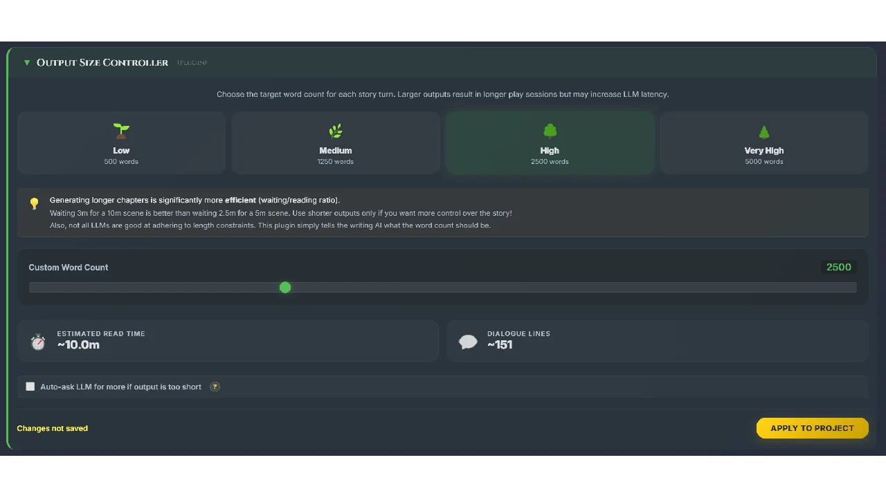</p>

### Interactive scene modes and gameplay experiments

- **Adventure Book** (`adventure_book`) — adds blocking d20-style storybook challenge loops before returning to the VN scene.

<p align="center">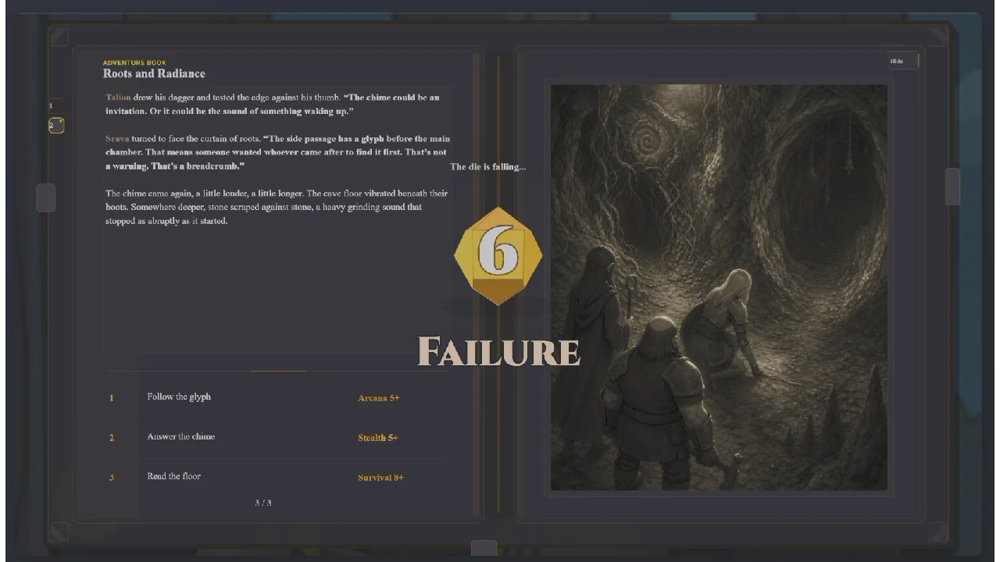</p>

- **Camp Rest** (`camp_rest_interludes`) — provides camp/rest overlays, invitation interludes, and scene replay.

<p align="center">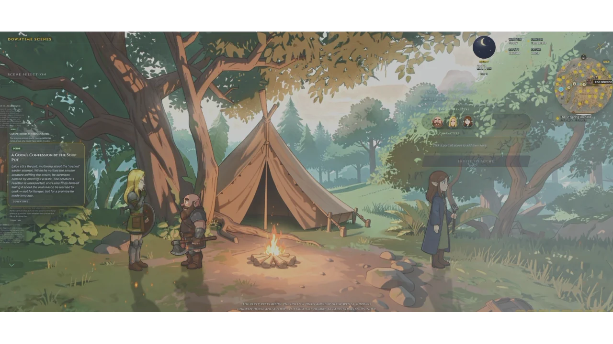</p>

- **Top-Down Shooter Gameplay** (`top_down_shooter_gameplay_interludes`) — *EXPERIMENTAL* a combat-focused shooter overlay for gameplay interludes.

### Plugin-development references

- **Toolkit Demo** (`toolkit_demo`) — examples for utilities, pipelines, hook dispatch, and token counting.
- **Example: Background Job** (`example_background_job`) — tracked background work with progress, cancellation, and failure handling.
- **Example: Custom File Type** (`example_custom_file_type`) — a structured Content Manager file type using selected project files safely.
- **Example: Custom View** (`example_custom_view`) — a plugin-owned application view with a socket request/response flow.
- **Example: Director Integration** (`example_director_integration`) — a Director capability, project directive, and previous-turn feedback loop.
- **Example: PixiJS Intercept** (`example_pixi_intercept`) — a minimal blocking PixiJS takeover with cleanup.
- **Example: Plugin Exports** (`example_plugin_api`) — a small validated API exposed to other plugins.
- **Example: Plugin Interoperability** (`example_plugin_api_consumer`) — optional dependencies and safe calls into another plugin.
- **Example: Plugin Documentation** (`example_plugin_documentation`) — contributes a page to the built-in documentation portal.
- **Example: Plugin Settings** (`example_plugin_settings`) — defines and updates settings schemas safely.
- **Example: Plugin State and Facts** (`example_plugin_state`) — demonstrates runtime state, persisted turn state, and scoped facts.
- **Example: Prompt and LLM** (`example_prompt_llm`) — an alias-routed LLM task with validated prompt injection.
- **Example: Secret Storage** (`example_secret_storage`) — declares and checks an encrypted plugin secret.
- **Example: Terminal Commands** (`example_terminal_commands`) — namespaced terminal commands with validation and bounded database access.
- **Example: VN Client Events** (`example_vn_client_events`) — timed, one-shot, and line-scoped client events.
- **Example: VN Frontend Injection** (`example_vn_frontend_injection`) — persistent VN HTML, CSS, JavaScript, sockets, and cleanup.
- **Example: VN GUI Intercepts** (`example_vn_gui_intercept`) — advanced blocking, chained, timed, backend-backed, and PixiJS intercept patterns.
 
<p align="center">
  
</p>

## FAQ: bringing an existing world into Fablekin

### Can I bring over a SillyTavern lorebook and character cards?

The content is reusable. The Lore Book plugin can already partially import most SillyTavern lorebooks; review the result afterwards because application-specific fields and advanced logic may not yet map one-to-one.

| Existing material | How you can use it today | Compatibility status |
| --- | --- | --- |
| World lore, rules, history, locations, or wiki-style text | Add the files as project canon through the Content Manager. Fablekin can work with ordinary prose and Markdown; it does not require every fact to be keyworded. | Available now |
| A carefully keyworded lorebook | Use the bundled, opt-in **Lore Book** plugin. It supports keywords, regular expressions, case-sensitive and whole-word matching, always-active entries, priorities, per-entry scan depth, recursive triggers, and a shared token budget. | Available now; native Fablekin JSON round-trips fully |
| A SillyTavern compatible world info JSON | Import it through the Lore Book plugin. Most standard entries can be partially imported; review keywords, insertion behavior, and any advanced logic or macros after import. | Partial import available now |
| Character-card text or a large character write-up | Paste the meaningful text into a character source file and mark it as a **Character Sheet**, or mark a multi-character document as a **Supporting Cast** source. The Character Sheets plugin synthesizes it into Fablekin's persistent format. If not using those plugins, simply add the character's lore as "Full text".| Available now |
| A platform-specific character-card PNG/JSON | Copy or extract its character text first. Card-specific macros, scripts, and extension fields may need manual adaptation. | Direct card-format import is not currently available |

### Do I need to rebuild my world as a keyworded lorebook?

No. Fablekin supports two complementary workflows:

- **Native canon:** add long-form lore as ordinary project files. This is the simplest path for wiki exports, setting documents, world rules, histories, and other prose-heavy material.
- **Triggered lore:** use the Lore Book plugin when an entry should appear only after a keyword or regular expression matches, must always be active, or needs explicit priority and scan-depth control.

You can mix both approaches in the same project. Broad world material can remain native canon while precise conditional entries stay in triggered lore books.

### What replaces character cards?

Fablekin treats a card or character dump as **source material**, rather than as the character's permanent runtime state. The Character Sheets plugin reads that source once, synthesizes a structured high-fidelity sheet for core characters, and caches the result. A large supporting-cast document can be split into smaller **lite capsules** so recurring NPCs do not all consume full-sheet context at once.

Those records can then evolve with the story. Depending on the plugins you enable, Fablekin can maintain biography and voice alongside current goals, important memories, aliases, personality development, relationships, and location or party state. The player and selected core sheets retain high detail, while supporting capsules are chosen by relevance within a configurable context limit.

This is not intended to make your existing character work disposable: descriptions, examples, scenario notes, personality details, and setting ties are valuable input. The main migration caveat is that application-specific macros or executable card extensions do not automatically translate into Fablekin behavior.


If Fablekin has been useful to you, you can [support its development on Ko-fi](https://ko-fi.com/ineyve).
